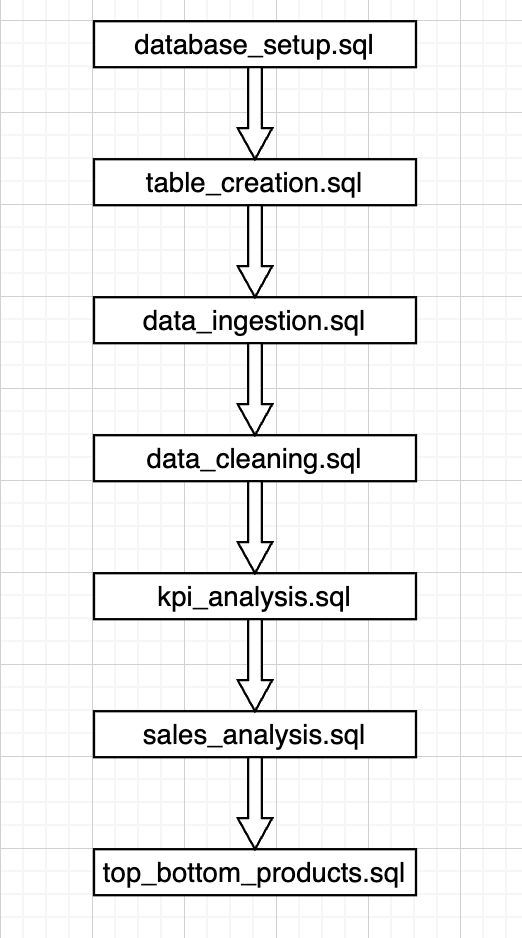
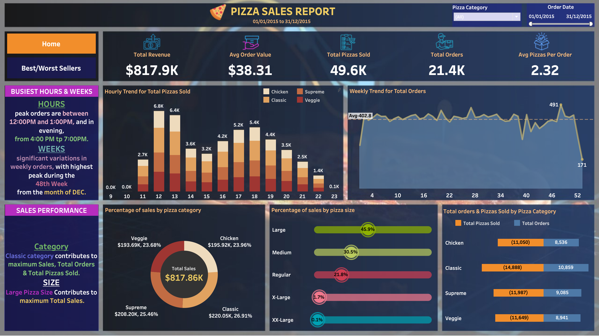
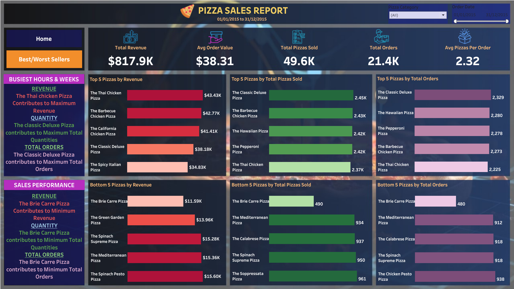

# 🍕 Pizza Sales Analysis

An end-to-end data analytics project analyzing historical pizza sales transactions to uncover revenue trends, customer ordering patterns, and product performance. 

This project demonstrates a complete analytical workflow: **Python** for raw data preparation, **Microsoft SQL Server (via Docker)** for data ingestion, cleaning, transformation, and complex KPI calculations, and **Tableau** for interactive business reporting.

---

## 📌 Project Overview

Raw transaction data often presents formatting issues, irregular delimiters, and unoptimized schemas. The goal of this project is to clean transform, and analyze unstructured pizza sales data to support business decision-making in:

- **Revenue & Order Performance:** Monitoring high-level executive KPIs.
- **Customer Demand:** Identifying peak ordering hours, days, and size/category preferences.
- **Product Strategy:** Pinpointing top-performing revenue drivers and bottom-performing menu items.
- **Inventory & Operations:** Informing stock planning based on sales volume and order patterns.

---

## 🎯 Business Objectives

This analysis answers key operational and financial questions:
* What is the total revenue generated, total orders placed, and overall unit sales volume?
* What is the Average Order Value (AOV) and Average Pizzas Per Order?
* Which specific days and hours show peak ordering activity?
* How does sales performance vary across pizza categories and sizes?
* Which 5 pizzas drive the highest revenue, quantity, and orders?
* Which 5 pizzas are underperforming across sales, quantity, and order count?

---

## 🛠️ Tools & Technologies

|          Layer             |     Tool / Technology    |                              Purpose                          |
|----------------------------| -------------------------| --------------------------------------------------------------|
| **Database & Analytics**   | Microsoft SQL Server     | Relational storage, schema design, data cleaning, aggregation |
| **Containerization**       | Docker                   | Containerized SQL Server environment                          |
| **Data Preparation**       | Python (Pandas)          | Delimiter conversion (`|`), path handling, preprocessing      |
| **Visualization**          | Tableau Desktop          | Interactive dashboards (Sales Overview & Product Performance) |
| **Environment**            | VS Code, Microsoft Excel | Script development, SQL query execution, raw data checks      |

---

# 🐍 Python Data Preparation

The project includes a Python script:

python/convert.py

The script prepares the CSV file for SQL Server ingestion by converting the CSV delimiter to a pipe (|) delimiter.

This matches the SQL Server ingestion configuration:

FIELDTERMINATOR = '|'

The script uses relative project paths so that it does not depend on a specific computer or username.

---


## 🗄️ SQL Analysis Workflow

The SQL pipeline is structured sequentially to ensure clear separation of concern:



---

## 📊 Tableau Dashboard

The project contains a two-page Tableau dashboard.

🖼️ Dashboard 1 — Sales Overview

 📊 Key Performance Indicators (KPIs)

The Sales Overview dashboard provides a high-level view KPI metrics:

* 💰 **Total Revenue:** Sum of all pizza sales transaction values.
* 🧾 **Average Order Value (AOV):** Total revenue divided by total unique orders.
* 🍕 **Total Pizzas Sold:** Cumulative quantity of all pizzas ordered.
* 📦 **Total Orders:** Count of unique `order_id` values.
* 📈 **Average Pizzas Per Order:** Total pizzas sold divided by total orders.



🖼️ Dashboard 2 — Product Performance

The Product Performance dashboard focuses on identifying:

🍕 Top Performing Pizzas: Identified the pizzas generating the highest revenue, sales quantity, and order volume.
📉 Bottom Performing Pizzas: Identified the pizzas with the lowest revenue, sales quantity, and order volume.



---

## 📁 Project Structure

```text
Pizza-Sales-Analysis/
│
├── README.md
├── .gitignore
│
├── data/
│   └── README.md
│
├── documentation/
│   ├── PROJECT_DOCUMENTATION.pdf
│   └── DATA_DICTIONARY.md
│
├── python/
│   └── convert.py
│
├── screenshots/
│   ├── dashboard_page1_sales_overview.png
│   └── dashboard_page2_product_performance.png
│
├── sql/
│   ├── 01_database_setup.sql
│   ├── 02_table_creation.sql
│   ├── 03_data_ingestion.sql
│   ├── 04_data_cleaning.sql
│   ├── 05_kpi_analysis.sql
│   ├── 06_sales_analysis.sql
│   └── 07_top_bottom_products.sql
│
└── tableau/
    └── Pizza_Sales_Dashboard.twbx
```
---

## 🔑 Skills Demonstrated
🗄️ Database & Data Ingestion
  * Microsoft SQL Server – Database 
  * Creation & Table Creation
  * SQL Server Data Ingestion
  * BULK INSERT
  * Docker
🐍 Python – Data Preparation
  * CSV Processing & Data Ingestion
  * Data Cleaning
  * Data Formatting
  * Data Transformation
  * Data Preparation
📊 SQL – Data Analysis
  * Aggregations – SUM(), COUNT(DISTINCT)
  * GROUP BY
  * ORDER BY
  * Subqueries
  * Date & Time Functions – DATEPART(), DATENAME()
  * Data Type & Date Conversion – TRY_PARSE(), TRY_CAST()
📈 Tableau – Data Visualization
  * Interactive Dashboards
  * KPI Analysis
  * Revenue Analysis
  * Sales Trend Analysis
  * Category Analysis
  * Size Analysis
  * Product Ranking
  * Time-Series Analysis
  * Top/Bottom Product Analysis
💡 Analytics & Business Skills
  * Exploratory Data Analysis (EDA)
  * Data Analysis
  * Product Performance Analysis
  * Business Insights

---

## 💼 Business Value

This analysis helps businesses:

* Monitor revenue and order KPIs
* Identify peak sales periods
* Understand customer ordering patterns
* Identify high- and low-performing products
* Evaluate category and size contribution
* Support inventory and sales planning

---


## 👩‍💻 Author

Sai Sahithi
Data Analyst | SQL | Python | Tableau | MSSQL Server | Excel | VSCode

⭐ If you find this project useful, feel free to explore the SQL scripts, Tableau dashboard, and documentation.
